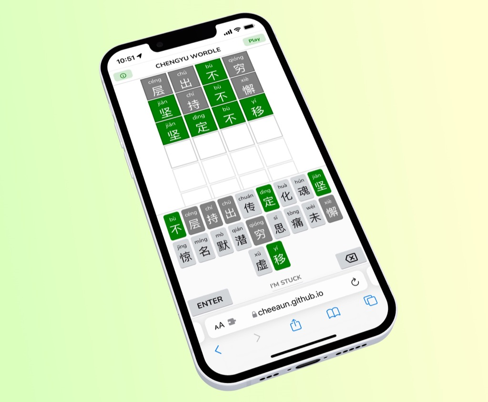
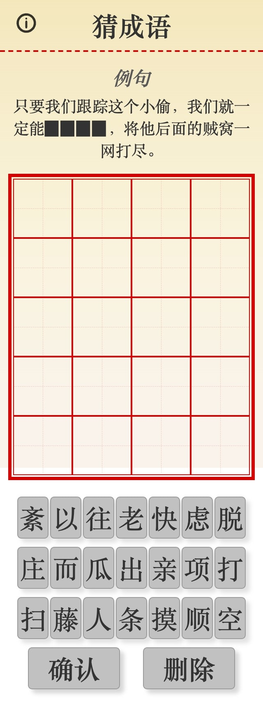
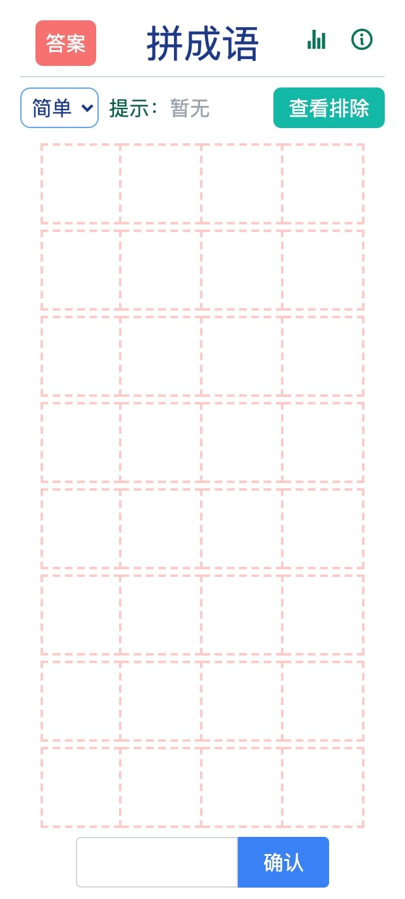
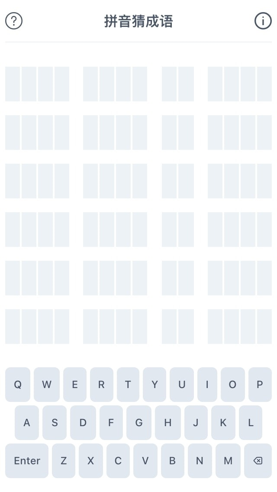
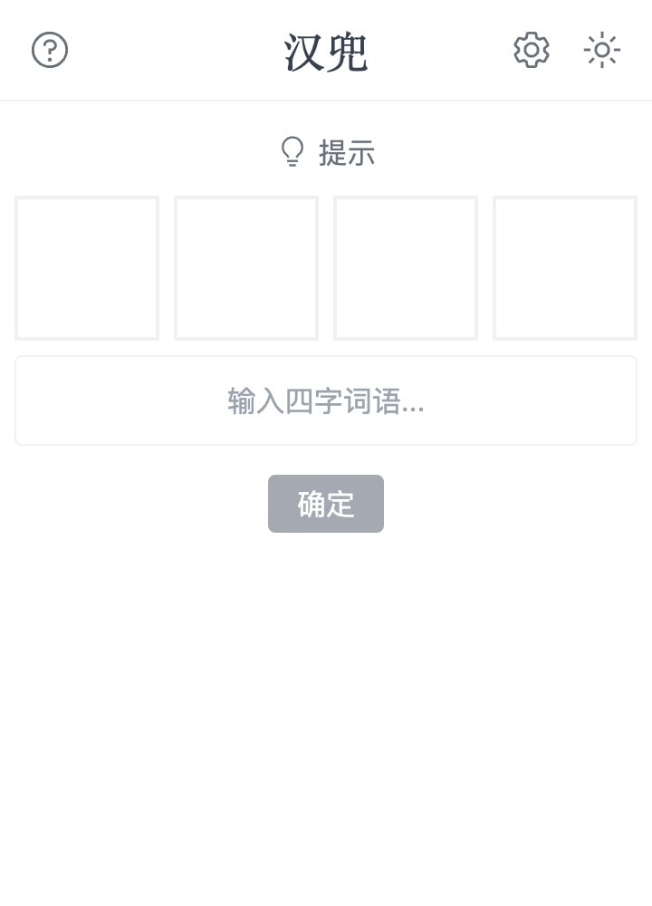
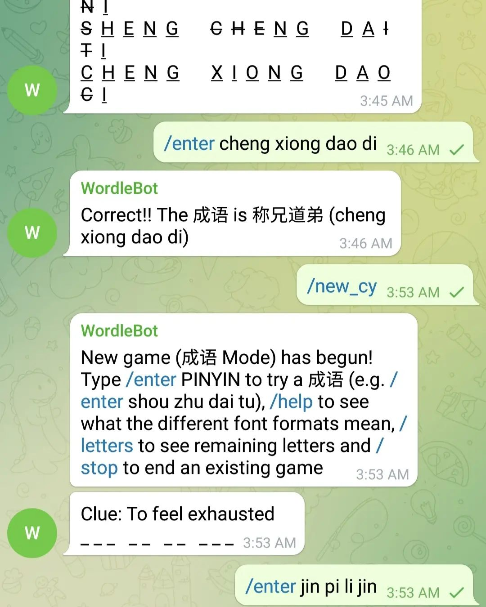
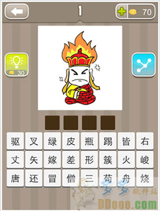

# Chengyu Wordle

> Wordle, for Chinese idioms - 成语 (chéngyǔ)
>
> Guess the idiom in 6 tries. 

This is my attempt at recreating [Wordle](https://www.nytimes.com/games/wordle/), made by [Josh Wardle](https://twitter.com/powerlanguish), from scratch.

## Screenshot

## Story

I play Wordle sometimes and thought that it's pretty cool. Personally I don't find the Wordle *braggings* useful. They kind of pollute the social media timelines (Facebook, Twitter) but at least they're better than ads 🔥🤷‍♂️.

Then, I came across few "forks" of Wordle:

- [Primel, by David Lawrence](https://twitter.com/millerdl/status/1484286518005051394) - guess a 5 digit prime number.
- [Katla, by Fatih Kalifa](https://twitter.com/pveyes/status/1484454960586579968) - Wordle, in Indonesian language.
- [Thwordle, by Manassarn Manoonchai](https://twitter.com/narze/status/1484596261277900810) - Wordle, in Thai language.
- [Katapat, by Eugene Low](https://amanz.my/2022322924/) - Wordle, in Bahasa Malaysia.

I'm like, "Hey, that's pretty cool, but maybe I could try something else?".

One day, I [tweeted](https://twitter.com/cheeaun/status/1484482726644183041):

> **Wordle, but for Chinese idioms.**
> 
> #idea
> 

**👉👉 Continue reading: [Chengyu Wordle Is Not a Love Story](https://cheeaun.com/blog/2022/02/chengyu-wordle-is-not-a-love-story/) 👈👈**

## Media coverage

- [Wikipedia: Wordle](https://zh.wikipedia.org/wiki/Wordle#cite_note-45)
- 4 Mar 2022: **Week in China** - [More than mere words](https://www.weekinchina.com/2022/03/more-than-mere-words/)
- 26 Feb 2022: **Little Day Out** - [11 Other “Wordle” Challenges to Try
](https://www.littledayout.com/11-other-wordle-challenges-to-try/)
- 19 Feb 2022: **Shopee Blog** - [Can’t Get Enough Of Wordle? Here’s 17 Wordle Variants To Try
](https://shopee.sg/blog/best-wordle-games/)
- 11 Feb 2022: **红蚂蚁** - [连总理都推荐的爆红猜字游戏Wordle　为何在全球疯狂吸粉？](https://www.redants.sg/good-reads/story20220211-5941)
- 10 Feb 2022: **AsiaOne** - [Want more Wordle? Here are 13 spin-offs to try, including a Singlish version](https://www.asiaone.com/lifestyle/want-more-wordle-here-are-13-spin-offs-try-including-singlish-version)
- 6 Feb 2022: **新加坡眼** - [这款小游戏风靡全球，让李显龙总理都“玩上瘾了”](https://www.yan.sg/lixinglongzholi/)
- 4 Feb 2022: **Mothership** - [PM Lee says Wordle a fun way to keep the mind engaged, recommends Chinese & Malay versions](https://mothership.sg/2022/02/pm-lee-says-wordle-a-fun-way-to-keep-the-mind-engaged-recommends-chinese-malay-versions/)
- 4 Feb 2022: **8world Entertainment Lifestyle** - [全世界都在Wordle！快试试数字版Nerdle](https://entlife.8world.com/life/nerdle-nerdle-is-a-new-maths-based-wordle-clone-1718676)
- 3 Feb 2022: **Lee Hsien Loong** - [...I was also pleasantly surprised to find out that there are Chinese and Malay versions of the game. Give it a go — a simple but fun way to keep the mind engaged. ](https://www.facebook.com/leehsienloong/posts/484183366401131)
- 2 Feb 2022: **Kotaku** - [A Sensational Wordle Clone Without Any Actual Words](https://kotaku.com/games-like-wordle-subwaydle-nyct-mta-best-routes-1848461481)
- 30 Jan 2022: **Sixth Tone** - [Wordle-Like Games Slowly Gain Traction on Chinese Social Media](https://www.sixthtone.com/news/1009586/wordle-like-games-slowly-gain-traction-on-chinese-social-media-)
- 30 Jan 2022: [6種英文和中文的 Wordle 猜字遊戲 打發時間真好用](https://blog.user.today/wordle-games-gallery/)
- 28 Jan 2022: **Ninchanese** - [Chinese Wordle: Play and Learn Chinese (chengyus)!](https://ninchanese.com/blog/2022/01/28/chinese-wordle-play-and-learn-chinese-chengyus/)

## Technicalities

### Tech

This game is built with these wonderful technologies:

- [Node.js](https://nodejs.org/) 14+ (with ESM support)
- [Vite](https://vitejs.dev/)
- [Preact](https://preactjs.com/)

Commands:

- `npm i` - install dependencies
- `npm run dev` - start a development server

Notes:

- "Unique" IDs are generated for every idiom. They are not 100% unique and are generated with [shorthash2](https://github.com/jecsham/shorthash2). I've tested using this and it's definitely possible to get the same hash for different idioms, if it's used to generate hashes for ALL idioms. Now it's only used for high-frequency idioms (smaller list).
- Generated "keys" for the keyboard are not guaranteed to be persistent for every idiom. They are dynamically generated based on the list of idioms. So if the list of idioms or the order of the idioms changes, the keys will change. This will affect the shared results with emojis (🟩🟧⬜).
- It's possible to fork this and change all idioms.

### Data

⚠️ If you don't want to be spoiled, avoid reading the data marked with 🚨**SPOILERS**🚨.

**Raw data** stored in `data/`.

- List of idioms from [pwxcoo/chinese-xinhua](https://github.com/pwxcoo/chinese-xinhua) via [wenhuangzeng/chinese-idiom-chengyu](https://github.com/wenhuangzeng/chinese-idiom-chengyu/blob/master/src/data/idiom.json).
- 🚨**SPOILERS**🚨 List of [high-frequency idioms from THUOCL (THU Open Chinese Lexicon)](http://thuocl.thunlp.org/source/THUOCL_chengyu.txt). I discovered this via [AllanChain/chinese-wordle](https://github.com/AllanChain/chinese-wordle). GitHub repo: [thunlp/THUOCL](https://github.com/thunlp/THUOCL/blob/master/data/THUOCL_chengyu.txt)

**Game data** stored in `game-data/` are processed by running `npm run data`, which produces two files:

- `all-idioms.txt` - list of *all* idioms, one per line.
- 🚨**SPOILERS**🚨 `game-idioms.csv` - list of idioms to be used in the game, with assigned *"unique"* `id`. This list is mainly from THUOCL's high-frequency idioms.

### Localization

- English: `./i18n/en.json`
- 中文: `./i18n/zh-CN.json`

As of now, 中文 is very roughly translated from English via Google Translate, which may not be great. **Help is needed for translations!**

## Other similar attempts

### [猜成语 (Cāi chéngyǔ)](https://bryony.dev/chengyu/chengyu.html) by [@nurupo_dev](https://twitter.com/nurupo_dev) - Guess the idiom

### [拼成语 | Chinese Wordle](https://allanchain.github.io/chinese-wordle/) by [Allan Chain](https://allanchain.github.io/blog/)

### [拼音猜成语 (Pīnyīn cāi chéngyǔ)](https://pinyincaichengyu.com/) by [limboy](https://limboy.me/)

### [汉兜 (Hàn dōu)](https://handle.antfu.me/) by [Anthony](https://twitter.com/antfu7) & [Inès](https://twitter.com/iiiiiiines_____)

### [Telegram @unofficial_wordle_bot](https://t.me/unofficial_wordle_bot) by [Oh Chin Yang](https://www.facebook.com/iamohcy)

### [疯狂猜成语安卓版 (Fēngkuáng cāi chéngyǔ ānzhuō bǎn)](http://www.ddooo.com/softdown/44315.htm) - Android game called "Crazy Guess Idioms".

🟩🟨🟩🟨🟩🟨🟩🟨🟩🟨🟩🟨🟩

**A lot more Wordle clones here**

- [Wordles of the World](https://rwmpelstilzchen.gitlab.io/wordles/)
- [puzzlet/awesome-wordle](https://github.com/puzzlet/awesome-wordle)

🟩🟨🟩🟨🟩🟨🟩🟨🟩🟨🟩🟨🟩

## Copyright and license

- Wordle ©️ The New York Times Company
- Everything else: [MIT license](https://cheeaun.mit-license.org/)