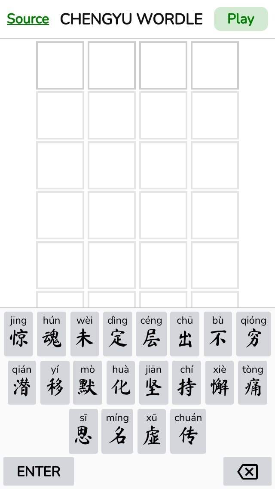

# Chengyu Wordle

> Wordle, for Chinese idioms - 成语 (chéngyǔ)
>
> Guess the idiom in 6 tries. 

This is my attempt at recreating [Wordle](https://www.powerlanguage.co.uk/wordle/), made by [Josh Wardle](https://twitter.com/powerlanguish), from scratch.

## Screenshot

## Technicalities

### Tech

This game is built with these wonderful technologies:

- [Node.js](https://nodejs.org/) 14+ (with ESM support)
- [Vite](https://vitejs.dev/)
- [Preact](https://preactjs.com/)

Commands:

- `npm i` - install dependencies
- `npm run dev` - start a development server

Notes:

- "Unique" IDs are generated for every idiom. They are not 100% unique and are generated with [shorthash2](https://github.com/jecsham/shorthash2). I've tested using this and it's definitely possible to get the same hash for different idioms, if it's used to generate hashes for ALL idioms. Now it's only used for high-frequency idioms (smaller list).
- Generated "keys" for the keyboard are not guaranteed to be persistent for every idiom. They are dynamically generated based on the list of idioms. So if the list of idioms or the order of the idioms changes, the keys will change. This will affect the shared results with emojis (🟩🟨⬜).
- It's possible to fork this and change all idioms.

### Data

⚠️ If you don't want to be spoiled, avoid reading the data marked with 🚨**SPOILERS**🚨.

**Raw data** stored in `data/`.

- List of idioms from [wenhuangzeng/chinese-idiom-chengyu](https://github.com/wenhuangzeng/chinese-idiom-chengyu/blob/master/src/data/idiom.json).
- 🚨**SPOILERS**🚨 List of [high-frequency idioms from THUOCL (THU Open Chinese Lexicon)](http://thuocl.thunlp.org/source/THUOCL_chengyu.txt). I discovered this via [AllanChain/chinese-wordle](https://github.com/AllanChain/chinese-wordle).

**Game data** stored in `game-data/` are processed by running `npm run data`, which produces two files:

- `all-idioms.txt` - list of *all* idioms, one per line.
- 🚨**SPOILERS**🚨 `game-idioms.csv` - list of idioms to be used in the game, with assigned *"unique"* `id`. This list is mainly from THUOCL's high-frequency idioms.

## Story

I play Wordle sometimes and thought that it's pretty cool. Personally I don't find the Wordle *braggings* useful. They kind of pollute the social media timelines (Facebook, Twitter) but at least they're better than ads 🔥🤷‍♂️.

Then, I came across few "forks" of Wordle:

- [Primel, by David Lawrence](https://twitter.com/millerdl/status/1484286518005051394) - guess a 5 digit prime number.
- [Katla, by Fatih Kalifa](https://twitter.com/pveyes/status/1484454960586579968) - Wordle, in Indonesian language.
- [Thwordle, by Manassarn Manoonchai](https://twitter.com/narze/status/1484596261277900810) - Wordle, in Thai language.

I'm like, "Hey, that's pretty cool, but maybe I could try something else?".

One day, I [tweeted](https://twitter.com/cheeaun/status/1484482726644183041):

> **Wordle, but for Chinese idioms.**
> 
> #idea

This is timely, because Chinese New Year is coming up.

I looked up some data from the Googleverse and realised this is kind of doable. It's actually a bit difficult for me to build this because I can't actually read or write Chinese. But heck, who cares, buidling a game is fun.

## Other attempts

- [拼音猜成语 (Pīnyīn cāi chéngyǔ)](https://pinyincaichengyu.com/) by [limboy](https://limboy.me/)
- [疯狂猜成语安卓版 (Fēngkuáng cāi chéngyǔ ānzhuō bǎn)](http://www.ddooo.com/softdown/44315.htm) - Android game called "Crazy Guess Idioms".

## Copyright and license

- Wordle ©️ Josh Wardle
- Everything else: [MIT license](https://cheeaun.mit-license.org/)